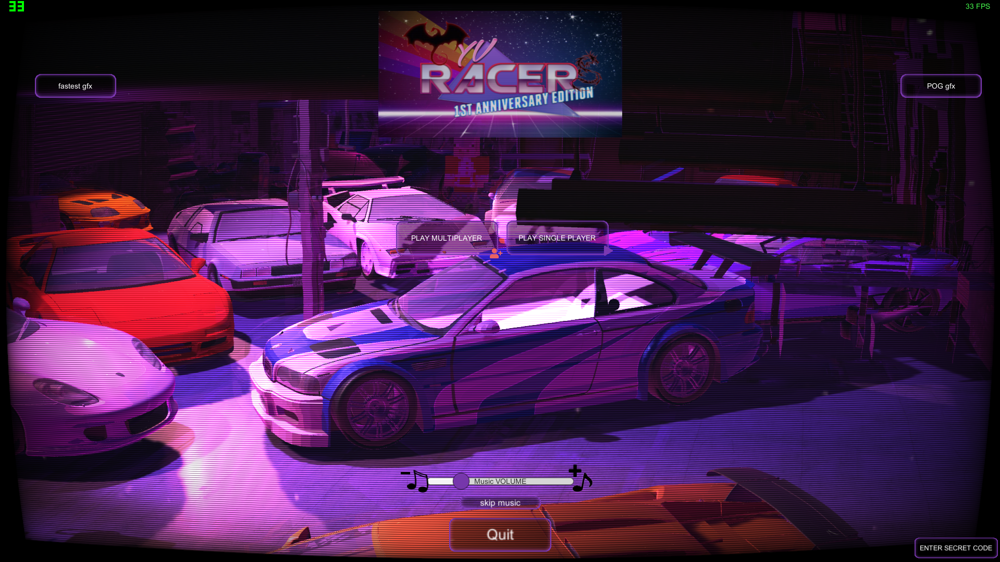

<!DOCTYPE html>
<html lang="en">     
<head>
<meta charset="UTF-8">
<title>WyvRacers site</title>
</head>
<body>
<h1>Check out cool and quirky game:</h1>

PC LINK:

    

ANDROID LINK:

</body>

</html>
