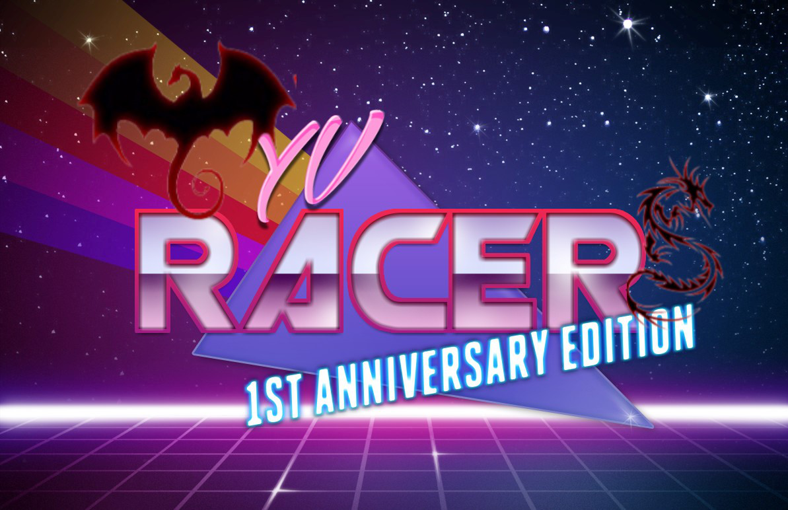

# Wyvracers.github.io
<html lang="en">     
<head>
<meta charset="UTF-8">
<title>WyvRacers site</title>
</head>
<body>    
    
     
<h2>Check out cool and quirky game teaser by MUJI: </h2>
<a href="https://www.youtube.com/embed/eYjpP7DTkQ0">here</a>     

PC LINK:

    

ANDROID LINK:

</body>

</html>
